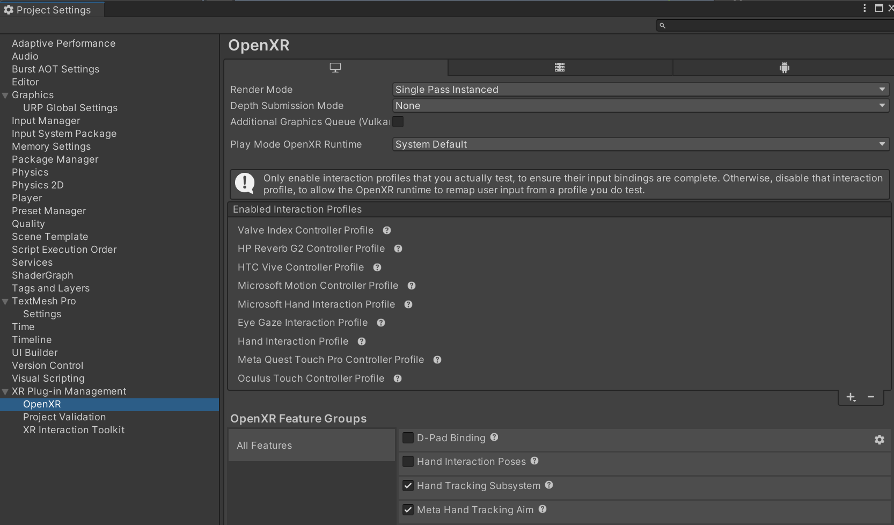

# Logs4AI
 Gets the metrics from the XR setup for AI

https://github.com/varjocom/VarjoUnityXRPlugin/blob/master/Samples~/HDRP/EyeTracking/Scripts/EyeTrackingExample.cs

Look at (get eye tracking from meta quest pro): 
        https://communityforums.atmeta.com/t5/Developer-Dashboard/Can-Quest-Pro-Eye-Tracking-data-be-accessed-on-a-PC/td-p/1002447

        https://steamcommunity.com/app/353380/discussions/11/4038102936186584544/?l=danish

 Project setup : 

